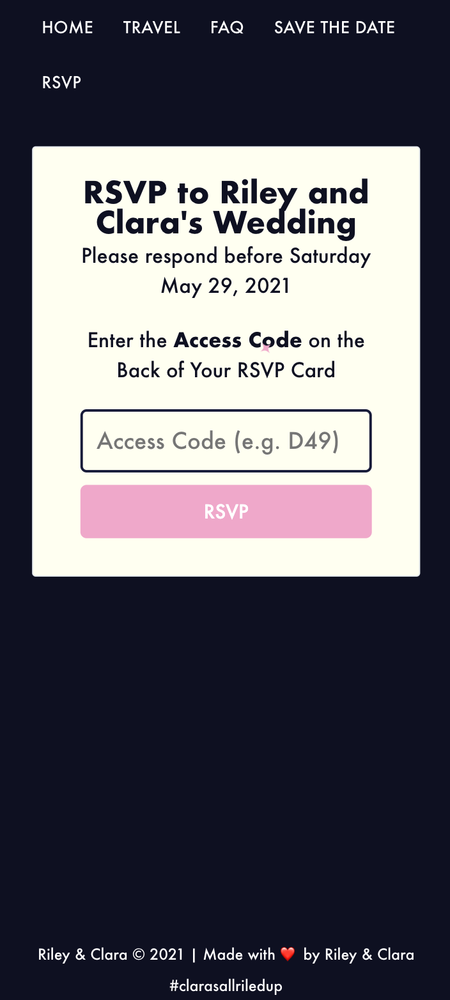
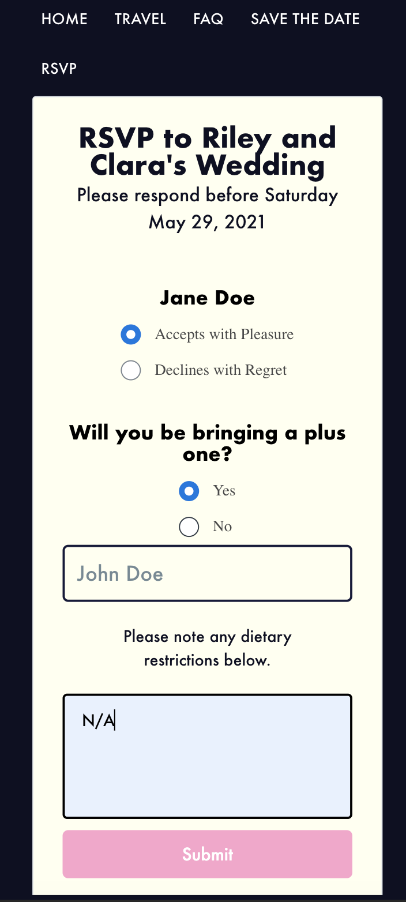

## Welcome
Here is the repo that Clara and I used to create our wedding site, hosted at [https://wedding.rileymiller.dev](https://wedding.rileymiller.dev). We made use of Gatsby, Typescript, Styled Components, Emotion, and
a small Serverless stack run on AWS to record RSVP responses.

Some of the small UI tricks that were implemented to spruce up the site include:
* An implementation of [Josh Comeau's React Sparkle component](https://www.joshwcomeau.com/react/animated-sparkles-in-react/) featured throughout the site.
* A small countdown feature on the home page to show how many days were left until the wedding
* SVGs Animations on the [Save The Date](https://www.clarasallriledup.com/save-the-date/) page.

## Getting Started

Make sure you have `node` installed.


**Install Dependencies**
```
yarn
```

**Start Local Stack**
To start the local stack run:

```
yarn dev
```

and you should see the site running at [http://localhost:8000](http://localhost:8000)

## CI
Using GitHub Actions to deploy the site to an S3 bucket configured with Cloudfront for the CDN. Here's the link to our [workflow](https://github.com/rileymiller/clara-riley-get-married/blob/master/.github/workflows/main.yml).

## Hosting
The site is now hosted on Cloudflare Pages at [https://wedding.rileymiller.dev](https://wedding.rileymiller.dev).

Previously, we deployed our site to an S3 Bucket with a Cloudfront Configuration. Here's a [link](https://www.rileymiller.dev/gatsby/deploy-gatsby-s3-gh-actions/#git-repo-on-github) to a blog I wrote with some steps on how to setup a Gatsby site to deploy to S3 via GitHub actions.

## RSVPs
For our RSVPs we assigned all of our guests a specific access code affiliated with their invite which we inscribed on the back of guests' invitations.

Upon receiving the invitation they would scan the QR code addendum in their invitation envelope which would route them to our [RSVP page](https://clarasallriledup.com).



Our guests would fill in their access code where our app would then go and fetch their invitation details from a JSON file and hydrate the RSVP form with the guest's information and hydrate the form with state for whether or not the guest was allotted a plus one to our wedding.



From here, our guests were able to fill out their RSVP and submit the form to our Serverless API running on Lambdas and DynamoDB which recorded our guests RSVP information and allowed us to give our vendors more accurate headcounts as well as give us an idea of which guests we needed to nag to fill out their RSVPs. :P
